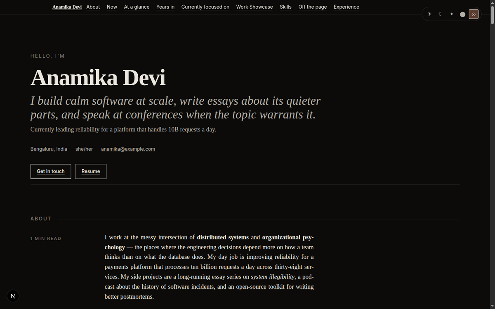
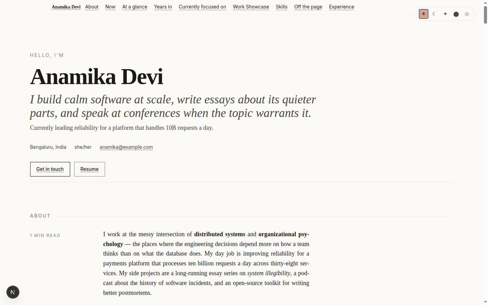
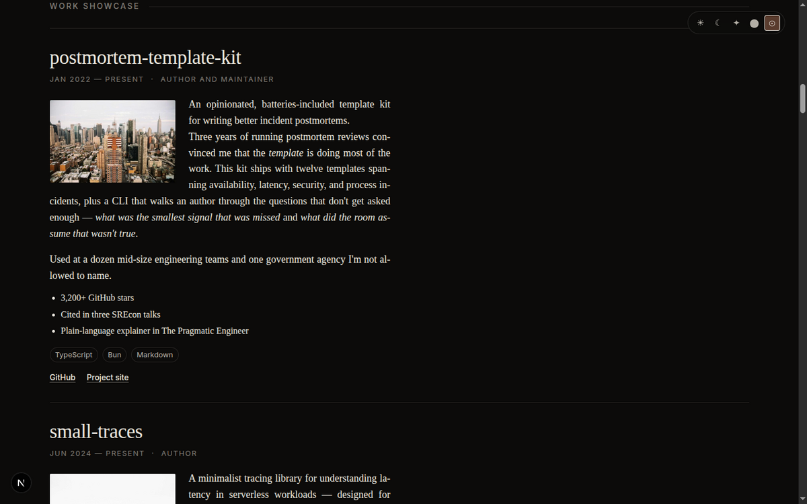
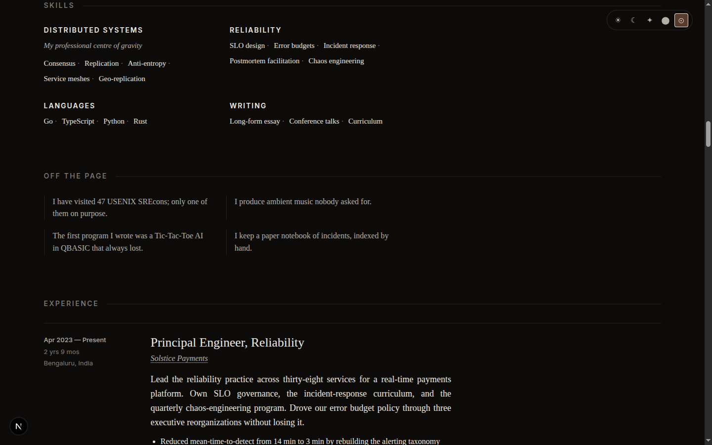
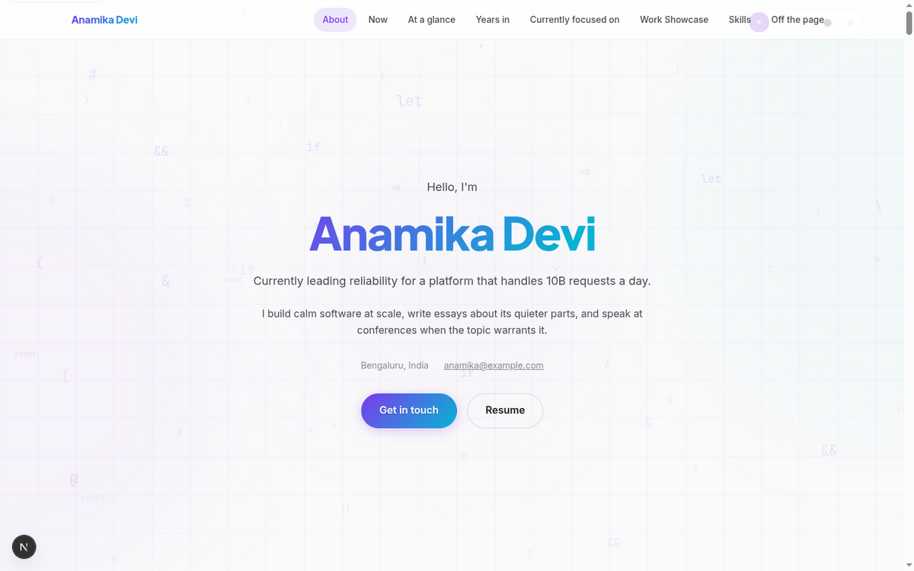
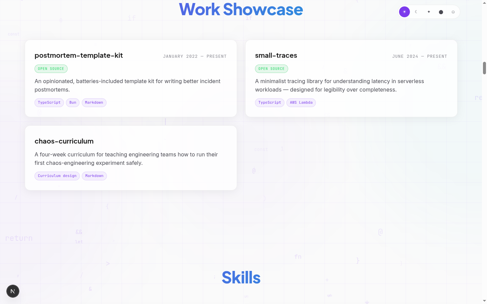
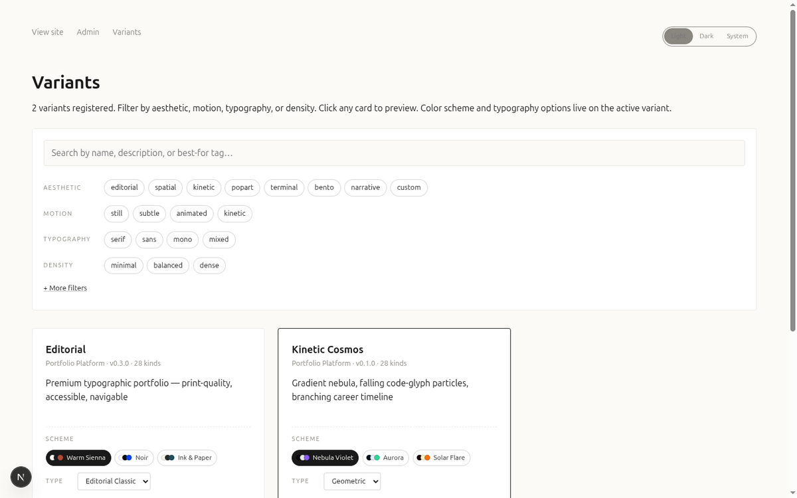
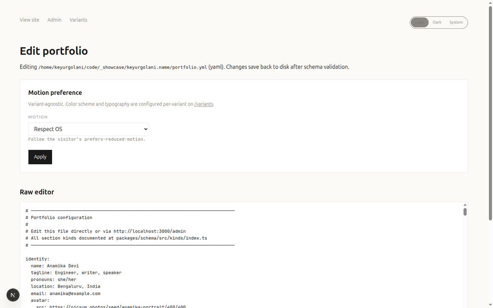

# 🎨 Portfolio Platform — Visual Showcase

A tour of the YAML-driven portfolio platform. You write a single `portfolio.yml`; the platform validates it against a typed schema and renders it through your chosen **variant** — a styled React tree that owns typography, color, motion, and layout. Switching variants changes the look without touching content.

> _Screenshots use the bundled `portfolio.example.yml` demo persona ("Anamika Devi"). All content is illustrative._

---

## ✍️ Editorial variant

A premium, print-quality typographic variant — accessible and navigable, with a serif voice.

### Hero (dark)

### Hero (light)
The same page in the `light` theme — one of five theme modes (`light`, `dark`, `bright`, `black`, `system`).

### Work Showcase
Project cards with imagery, rich descriptions, tech tags, and links.

### Skills

---

## 🌌 Kinetic Cosmos variant

The **same content**, a completely different aesthetic — gradient nebula, falling code-glyph particles, and a branching career timeline.

### Hero

### Projects

---

## 🧬 Variant gallery

Browse registered variants and filter by aesthetic, motion, typography, and density. Each variant ships its own color schemes and typography presets.

---

## ⚙️ Admin editor

Edit `portfolio.yml` from the browser at `/admin`. Changes validate against the schema and save back to disk. Motion preference and per-variant scheme/typography are configurable here.

---

## ✨ At a Glance

| Capability | Detail |
|------------|--------|
| **Content model** | Single `portfolio.yml`, validated against `@portfolio/schema` |
| **Section kinds** | 28 — hero, experience, projects, skills, GitHub, gallery, testimonials, publications, talks, awards, and more |
| **Variants** | Pluggable styled React trees; swap the entire look without touching content |
| **Themes** | `light`, `dark`, `bright` (paper-white), `black` (AMOLED), `system` |
| **Per-variant** | Color schemes + typography presets (editorial ships 3 schemes, 2 type pairings) |
| **GitHub** | Pinned repos, recent activity, contribution heatmap, language breakdown |
| **Extras** | Print stylesheet, RSS feed, structured data, OG image generation |
| **Editing** | Browser `/admin` editor with schema validation, or edit YAML directly |
| **Stack** | Next.js, TypeScript, pnpm workspace, Docker |

---

_See the [README](README.md) for setup, variant authoring, and the full feature list._
